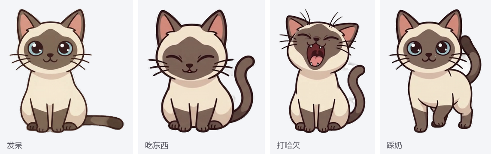

# 多多 · 桌面宠物猫


一只住在 Windows 桌面上的 Q 版暹罗猫。会自己走动、发呆、打哈欠、踩奶、扑镜头，能聊天、开网页、找文件、翻译剪贴板、报系统状态。PyQt6 编写，大模型走任意 OpenAI 兼容接口。



（发呆、吃东西、打哈欠、踩奶，素材原帧）


（发呆 → 走路 → 吃东西 → 打哈欠）

## 运行前先准备素材

动画素材 `frames_opt/`（452 张 PNG，约 70MB）没有放进仓库。克隆之后：

到 [Releases](../../releases) 下载 `frames_opt.zip`，解压到项目根目录（与 `多多.py` 同级）。解压正确的标志是能看到 `frames_opt/meta.json` 与 `frames_opt/idle/`、`frames_opt/walk/` 等子目录。

启动时若素材缺失，程序会弹出说明框指出缺什么、去哪里取，而不是报一句看不懂的错误。

不想装 Python：到 [Releases](../../releases) 把 `多多.exe` 与 `frames_opt.zip` 一起下载，解压到**同一个文件夹**（`多多.exe` 与 `frames_opt/` 并列），双击 exe 即可；首次运行会自动生成 `config.json`，填上 api_key 后重启就能聊天。exe 未做代码签名，Windows SmartScreen 可能拦一下，点「更多信息 → 仍要运行」。它由仓库里的 `build_exe.py` 打包，可以自己重新构建。

## 安装与启动

```powershell
pip install PyQt6
pip install edge-tts          # 可选，神经网络语音，需要联网
copy config.example.json config.json     # 填上自己的 api_key
python 多多.py
```

打包成单文件 exe：`python build_exe.py --clean`，产物 `多多.exe` 约 40MB，双击启动。exe 只打包代码，运行时读同目录的 `frames_opt/`、`config.json`、`pet_data.json`，换素材和改配置都不必重新打包。

全局热键：`Ctrl+Alt+D` 聊天、`Ctrl+Alt+C` 翻译剪贴板、`Ctrl+Alt+Z` 总结剪贴板。同一时刻只允许一只猫运行，重复启动会把已有那只叫到前台。

## 桌面上的行为

| 操作 | 结果 |
|---|---|
| 左键拖拽 | 拎起小猫，松手后靠边 40px 内吸附屏幕边缘 |
| 双击 | 抚摸，好感度 +1，冒爱心 |
| 拖文件到猫身上 | 文本类读内容并总结要点，之后可直接追问；文件夹列出条目；音频交给系统播放 |
| 点击气泡里的文件名 | 用默认程序打开；后面的「📂」打开所在文件夹，「记事本」「其它程序…」换程序打开 |
| 右键 | 四组菜单：互动（喂食/摸摸/散步/站立/睡觉/叫醒）、剪贴板、工具（截图/系统状态/音量/最近找到的文件）、设置 |

发呆时会随机眨眼（2.5~6.5 秒一次，偶尔连眨两下），呼吸的幅度与周期每周期随机换一次并偶尔加深。这两项由代码控制，不占用素材。

## 聊天能说什么

本地识别、不联网即可用的指令：

| 说法 | 结果 |
|---|---|
| `现在几点` / `今天几号` | 时间与日期 |
| `25分钟后提醒我喝水` / `番茄钟` / `取消提醒` | 定时提醒，存盘，重启不丢 |
| `每天18:30叫我下班` | 每天定点提醒 |
| `每周一9点提醒我开例会` / `每周一三五 8点 提醒我锻炼` / `工作日9点提醒我打卡` | 每周或工作日提醒 |
| `明天9点叫我起床` / `今晚8点提醒我看剧` | 定点一次性提醒 |
| `声音大一点` / `静音` | 系统音量 |
| `截个屏` | 截图存到桌面 |
| `念一下剪贴板` / `把剪贴板存下来` | 朗读剪贴板或存成桌面 txt |
| `剪贴板历史` / `用第2条翻译` | 列出最近复制的 10 条，对其中某一条做翻译、总结、解释、润色、帮回复 |
| `系统状态` | 电量、内存、CPU、联网状态 |
| `找文件 pet_data` → `打开第1个` | 找文件，用默认程序打开 |
| `用记事本打开第1个` / `换个方式打开第1个` | 指定程序打开，或弹出 Windows 的「打开方式」选择框 |
| `开启语音` / `试听一下` / `情绪演示` | 语音播报开关、试听音色、依次念八种情绪 |
| `开启看家模式` | 离开 5 分钟去睡、回来打招呼、连续用电脑 50 分钟提醒休息 |
| `开启全屏避让` / `打开开机自启` | 全屏应用时自动隐藏；开机自启 |

没命中这些说法时，问题会交给大模型，同时带上当前时间与好感度。模型可以在回复末尾附 `[action: eat]` 让小猫做动作，或 `[tool: open bilibili]`、`[tool: volume down]`、`[tool: clipboard summary]` 让小猫执行工具（白名单，未知工具忽略）。工具执行完会把结果回喂给模型再问一轮，因此「帮我找找 pet_data 然后打开它」可以一次说完。

## 语音

引擎按可用性依次尝试：edge 神经语音 → Windows OneCore → SAPI → PowerShell。默认音色是 edge 的晓伊，OneCore 走系统装机音色（瑶瑶、慧慧）。八种情绪（开心、兴奋、撒娇、困倦、提醒、得意、委屈、平常）通过语速与音调实现，同一句话按当前状态换语气。

edge-tts 走 aiohttp，不读 Windows 的 IE 代理设置，程序会自己从注册表取代理传给它：实测同一个端点直连约 11 秒、走代理约 1.2 秒，代理失效时退回直连。

## 工程

| 文件 | 内容 |
|---|---|
| `多多.py` | 窗口、绘制、动画状态机、行为、本地意图、工具派发 |
| `ai_assistant.py` | 大模型客户端、提示词、动作/工具/情绪标签解析、站点与文件查找 |
| `pet_tools.py` | 语音（多引擎 + 情绪）、日程解析、系统状态、音量、剪贴板历史 |
| `app_health.py` | 日志、单实例锁、开机自启、配置自检、空闲检测、全屏检测 |
| `pipeline.py`、`snapshot.py` | 素材流水线与快照回退；仅在你要自己改素材时用到 |
| `build_exe.py` | PyInstaller 打包，图标由素材首帧生成 |
| `使用说明.md` | 全部指令、配置项与排错表 |
| `docs/` | README 用的预览图与动图 |

## 测试

```powershell
$env:QT_QPA_PLATFORM="offscreen"
python selftest.py          # 29：帧资源、动画状态机、转圈首尾一致
python test_app_smoke.py    # 31：应用级冒烟
python test_assistant.py    # 158：大模型层（打桩，不联网）与集成
python test_tools.py        # 126：语音、日程、音量、快照、流水线
```

## 素材来源

角色形象由 AI 生成视频经抠图、对齐、修帧得到。请勿直接商用。
